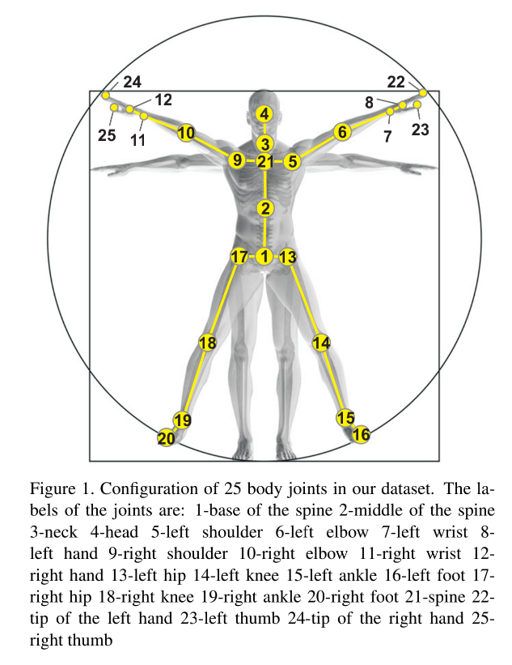
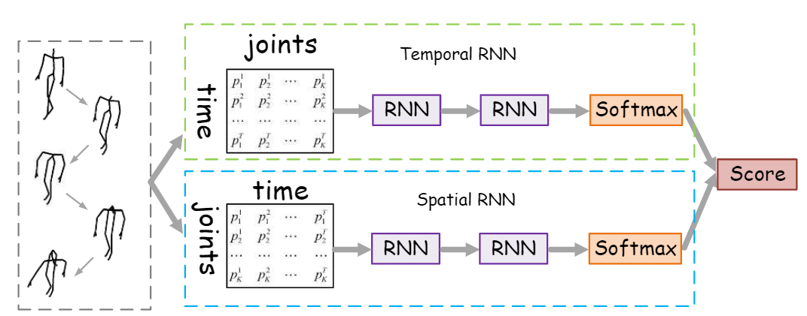

# Two-Stream-RNN-Pytorch
The Pytorch Implementation of '*Modeling Temporal Dynamics and Spatial Configurations of Actions UsingTwo-Stream Recurrent Neural Networks*'

****
# Welcome!😃😃
Hello Guys! It has been a really long long long time ever since my last repository. I am busy at some funcy work which will be released by the next month( when I passed the final examination😣😣) Anyway, if I am busy, then why would i creat this repository?

****
## Why implement a 2017 CVPR paper in 2021 which I am not even interested in :(
This repository is one of my final examination, '*Deep Learning and Computer Vision*' 😅. I tried to find some implementation of this paper on github before, but all i got is 404 error.😅 So me and my teammates decided to do it ourselves. The DeadLine is at July 1th, and before that i will realesd all the codes (which haven't been done yet, sry) And if you find my work helpful, how about a star⭐！ 😋😋

****
## Realesed Part
|Part|Time|Description|
|----|----|----|
|model|6/16|[***~~the initial version of the model~~***](./model.py)|
||6/19|[***~~the fixed version of the model~~***](./model.py)|
||6/30|[the final version of the model](./model.py)|
|dataset|6/18|[How to creat dataloader from downloding to implementation](#dataset)|
||6/30|[How to use 3D transform](#dataset)|
|train|6/19|***~~[It's time to burn your gpu now my friend](#train)~~***|
||6/30|[Fixed a bunch of bugs and can work fine now](#train)|
|checkpoint|6/20|***~~[First checkpoint](#checkpoint)~~***|
||6/22|***~~[Second checkpoint](#checkpoint)~~***|
||6/30|[Fix bugs](#checkpoint)|
****
### model
due to the limitation of time, we will only train on __NTU RGB+D dataset__ . 25 joints are labeled for each person, and the original paper only have 20 joints for each skeleton, so the architecture of the two rnn have been modeified to fit the dataset. Check the code for details.
|😃|😄|
|----|----|
|NTU RGB+D dataset||
|Model architecture||
****
Basically, there are 2x2 combination ways between the Spatial RNN and Temporal RNN, which are `Chain + Stacked`, `Traversal + Stacked`, `Chain + Hierarchical`, `Traversal +  Hierarchical`. See codes down below in the [model.py](./model.py) and you will know how to combine them
- ***~~**Hot Issue 6/17** I tried to train this model but find the loss won't drop. Some bugs exist. Yet still the model code should be correct mostly😐~~** [Fixed]
****
### dataset
#### Downloading the dataset
- We will train our model only on __NTU RGB+D dataset__ which is already big enough for the model to gain robustness
- Download it with BaiduNetdisk [NTU RGB+D dataset(提取码:vnas)](https://pan.baidu.com/s/1E_rq-LK7ENoodvqtDZQ-dg)
#### Dataset decomposition
- Put the dataset file with the code and run [conver_data.py](./convert_data.py). If any errors occur, check the code from line 111 to line 113 and you may
change the data path. This Process should take at least 1 hour I guess?. You can go to play games now😉
- Then when you successfully decomposed the dataset file. It should generat a file named `NTU-RGB-D` which consist of two subfiles named
`xsub` and `xview`. There are three .npy and .pkl files in each of them.
- Finaly, build your dataloader like this
```python
data_path = "NTU-RGB-D/xview/val_data.npy"
    label_path = "NTU-RGB-D/xview/val_label.pkl"
    num_frame_path = "NTU-RGB-D/xview/val_num_frame.npy"
    dataset = Feeder(data_path, label_path, num_frame_path,random_valid_choose=False,
                     random_shift=False,
                     random_move=False,
                     window_size=100,
                     normalization=True,
                     debug=False,
                     origin_transfer=False)
                     
loader = torch.utils.data.DataLoader(
    dataset=dataset,
    batch_size=1,
    shuffle=True,
    num_workers=8, pin_memory=True)
```
#### 3D Transforms
```python
data_path = "NTU-RGB-D/xview/val_data.npy"
    label_path = "NTU-RGB-D/xview/val_label.pkl"
    num_frame_path = "NTU-RGB-D/xview/val_num_frame.npy"
    dataset = Feeder(data_path, label_path, num_frame_path,random_valid_choose=False,
                     random_shift=True,
                     random_move=True,
                     random_rotate=0.2,
                     window_size=100,
                     normalization=True,
                     debug=False,
                     origin_transfer=False)
                     
loader = torch.utils.data.DataLoader(
    dataset=dataset,
    batch_size=1,
    shuffle=True,
    num_workers=8, pin_memory=True)
```
****
### train
#### Set up training hyperparameters
- Sorry for my messy training code. In `train.py` from line 35 to line 37, there are some basic Hyperparameters to modify. You can simply just use mine. And if you want
to modify the number of epochs, watch out the multistep scheduler at line 116
- In `train.py` from line 84 to line 111, you can choose the different conbination of the two stream model. It will be easy to understand if you had checked the paper
****
### result

# Email Address
email me if you have any emergency issue
- mountchicken@outlook.com
